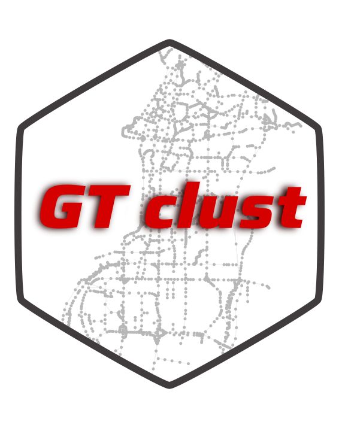

<!-- README.md is generated from README.Rmd. Please edit that file -->

```{r, include = FALSE}
knitr::opts_chunk$set(
  collapse = TRUE,
  comment = "#>",
  fig.path = "man/figures/README-",
  out.width = "100%"
)
```

# GTclust: fast clustering of spatial or temporal data with contiguity constrained hierarchical clustering

<!-- badges: start -->
<!-- badges: end -->



GTclust builds on top of `?gtclust_graph` it's main function to offers fast clustering of spatial or temporal data with contiguity constrained hierarchical clustering (with full-order relations see [@Guo2008,@Guo2009]). `?gtclust_graph` is a quite classical hierarchical algorithm but which is designed to takes advantage of contiguity constraints defined with a graph between data-points. The contiguity naturally create a sparsely connected graph that can be leveraged to speed-up the calculations, thanks to efficient data-structure [@Ambroise2019], from $O(N^2D)$ to $O(M(log(M)+D))$, with $M$ the number of links in the contiguity graph. To reach these performances, the dissimilarity matrix is computed on the fly and the algorithm resort to a more simple "stored data" approach [@Murtagh2012], which even if known to be less efficient in the general case are well fitted for the contiguity constrained problems with full-order relations. This approach allows to have a low spatial complexity of $O(N)$ but is less efficient with `single` and `complete` linkage criterions. Furthermore, this make the use of non-euclidean dissimilarity measures impossible. Still one may used the classical linkage criterion compatible with a storage based approach and available in `hclust` or `agnes` : 

- `ward` minimum within-cluster variance 
- `centroid` or WPGMC
- `median` or UPGMC

Furthermore, GTclust also offers Bayesian models that enable model selection :  

- `bayes_dgmm` diagonal Gaussian mixture models for continuous features
- `bayes_mom` mixture of Multinomial for counts data
- `bayes_dirichlet` mixture of Dirichlet distibution for compositional data

To ease, the contiguity graph creation process, gtclust offers several interfaces to works with geographical, temporal (the gt in GTclust comes from here) or sequential data:

- `?gtclust_temp` to cluster sequential data, the contiguity graph follow from the data ordering 
- `?gtclust_line` to cluster spatial networks
- `?gtclust_poly` to cluster data associated to geographical polygons, the contiguity graph follow from shared boundaries
- `?gtclust_delaunay` to cluster data associated to geographical points, the contiguity graph is derived from the Delaunay triangulation of the points (thanks to the `? RTriangle` package [@RTriangle])
- `?gtclust_knn` to cluster data associated to geographical points, the contiguity graph is derived from the symmetrized knn graph of the geographical points (thanks to the `?RANN` package [@RANN])
- `?gtclust_dist` to cluster data associated to geographical points, the contiguity graph is derived from a threshold over distance the geographical points 

It also offers several methods dedicated ot the manipulations of spatial results thanks to a tight integration with the sf package [@Pebesma2018].


## Installation

You can install the development version of gtclust from [GitHub](https://github.com/) with:

``` r
# install.packages("devtools")
devtools::install_github("comeetie/gtclust")
```

## Simple, example

This is a basic example of spatial network clustering

```{r example-data,message=FALSE}
library(gtclust)
library(dplyr)
library(sf)
library(ggplot2)
library(ggpubr)
data("shenzen")
hc = gtclust_lines(shenzen |> select(speed),method=gtmethod_bayes_dgmm())
plot(hc)
cl = cutree(hc,16)
```


To do the clustering, we use the `lines` flavor of GTclust and just provide the lines data.frame we had just prepared. Then we may use the classical function from `?hclust`, `?cutree` to cut the dendrogram at a specific level and the `?plot.gtclust` method to draw the dendrogram. In fact the result to a call to a gtclust_* function is a simple S3 object of class `?hclust` with additional fields. So the classical merge, height and order fields are available:

```{r}
class(hc)
#str(hc,max.level = 1)
```


You may also use the `?geocutree` function which build directly a spatial data.frame with the clustering results: 
```{r geoagg}
shenzen.clust = geocutree(hc,k=9)
shenzen.clust |> head()
```

The returned data.frame contains the geometries of each cluster together with their prototypes. 

```{r clustering,fig.show='hold',out.width="100%",fig.width=12,fig.height=6}
ggplot(shenzen.clust)+
  geom_sf(aes(color=factor(cl)))+
  theme_void()+
  scale_color_brewer(palette="Set1",guide="none")
```

# References