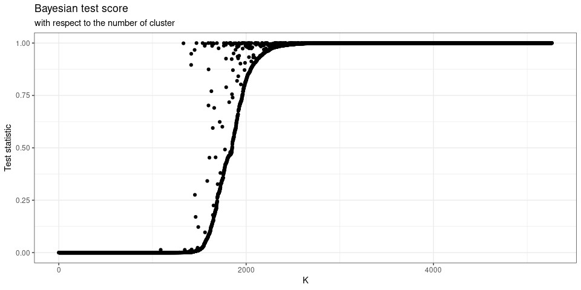

<!-- README.md is generated from README.Rmd. Please edit that file -->

# GTclust : A package for fast clustering of spatial or temporal data with contiguity constrained hierarchical clustering

<!-- badges: start -->
<!-- badges: end -->

GTclust builds on top of `?gtclust_graph` it’s main function to offers
fast clustering of spatial or temporal data with contiguity constrained
hierarchical clustering (with full-order relations see Diansheng Guo
(2009)). `?gtclust_graph` is a quite classical hierarchical clustering
but which is designed to takes advantage of contiguity constraints
defined with a graph between data-points. The contiguity naturally
create a sparsely connected graph that can be leveraged to speed-up the
calculations, thanks to efficient data-structure (Ambroise et al. 2019),
from
")
to
+D))"),
with

the number of links in the contiguity graph. To reach these
performances, the dissimilarity matrix is computed on the fly and the
algorithm resort to a more simple “stored data” approach (Murtagh and
Contreras 2012), which even if known to be less efficient in the general
case are well fitted for the contiguity constrained problems with
full-order relations. This approach allows to have a low spatial
complexity of
")
but is less efficient with `single` and `complete` linkage criterions.
Furthermore, this make the use of non-euclidean dissimilarity measures
impossible. Still one may used the classical linkage criterion
compatible with a storage based approach and available in `hclust` or
`agnes` :

-   `ward` minimum within-cluster variance
-   `centroid` or WPGMC
-   `median` or UPGMC

Furthermore, GTclust also offers two Bayesian linkage criterion (Heller
and Ghahramani 2005) that enable model selection :

-   `bayes_mom` mixture of Multinomial for counts data
-   `bayes_dgmm` diagonal Gaussian mixture models for continuous
    features

To ease, the contiguity graph creation process, gtclust offers several
interfaces to works with geographical, temporal (the gt in GTclust comes
from here) or sequential data:

-   `?gtclust_temp` to cluster sequential data, the contiguity graph
    follow from the data ordering
-   `?gtclust_poly` to cluster data associated to geographical polygons,
    the contiguity graph follow from shared boundaries
-   `?gtclust_delaunay` to cluster data associated to geographical
    points, the contiguity graph is derived from the Delaunay
    triangulation of the points (thanks to the `? RTriangle` package
    (Shewchuk 1996))
-   `?gtclust_knn` to cluster data associated to geographical points,
    the contiguity graph is derived from the symmetrized knn graph of
    the geographical points (thanks to the `?RANN` package (Arya et al.
    2019))
-   `?gtclust_dist` to cluster data associated to geographical points,
    the contiguity graph is derived from a threshold over distance the
    geographical points

It also offers several methods dedicated ot the manipulations of spatial
results thanks to a tight integration with the sf package (Pebesma
2018).

## Installation

You can install the development version of gtclust from
[GitHub](https://github.com/) with:

``` r
# install.packages("devtools")
devtools::install_github("comeetie/gtclust")
```

## Simple, example

This is a basic example, we first prepare some spatial polygons data,
here we used modes share in several municipalities around Paris.

``` r
library(gtclust)
library(dplyr)
library(sf)
library(ggplot2)
library(ggpubr)
data("modesshare.idf")

# compute row sums
modesshare.idf <- modesshare.idf |> 
  rowwise(CODE_IRIS) |> 
  mutate(total = sum(c_across(nodep:tcom)))

# normalize per rows
modesshare.idf.percent = modesshare.idf |> 
  filter(total!=0) |>
  transmute(across(nodep:tcom,\(v){v/total})) 

modesshare.idf.percent |> head()
#> Simple feature collection with 6 features and 7 fields
#> Geometry type: MULTIPOLYGON
#> Dimension:     XY
#> Bounding box:  xmin: 599008.8 ymin: 6826940 xmax: 731360.5 ymax: 6875456
#> Projected CRS: RGF93 v1 / Lambert-93
#> # A tibble: 6 × 8
#> # Rowwise:  CODE_IRIS
#>   CODE_IRIS  nodep marche   velo    drm voiture   tcom                  geometry
#>   <chr>      <dbl>  <dbl>  <dbl>  <dbl>   <dbl>  <dbl>        <MULTIPOLYGON [m]>
#> 1 772480000 0.0138 0      0      0.0138  0.831  0.141  (((685753.1 6868613, 685…
#> 2 784740000 0.0213 0      0      0.0319  0.830  0.117  (((600445.1 6864291, 600…
#> 3 772460000 0.0469 0.0235 0      0       0.836  0.0939 (((730354.4 6827002, 730…
#> 4 751114113 0.0321 0.0977 0.143  0.0360  0.0411 0.650  (((654130.1 6863651, 654…
#> 5 920440109 0.0132 0.185  0.0436 0.0561  0.240  0.462  (((648086.8 6866230, 648…
#> 6 772840103 0.0208 0.0948 0.0148 0.0102  0.540  0.319  (((692043 6875456, 69208…
```

To do the clustering, we use the `poly` flavor of GTclust and just
provide the polygons data.frame we had just prepared. Then we may use
the classical function from `?hclust`, `?cutree` to cut the dendrogram
at a specific level and the `?plot.gtclust` method to draw the
dendrogram:

``` r
hc=gtclust_poly(modesshare.idf.percent,method="ward")
#> Warning: Some features were not numeric and have been removed from the
#> clustering.
plot(hc)+
  ggtitle("Dendrogram of the modesshare.idf dataset","with ward linkage")+
  scale_y_continuous("Within-cluster intertia")
#> Scale for 'y' is already present. Adding another scale for 'y', which will
#> replace the existing scale.
cutree(hc,k=30) |> head(20)
#>  1  2  3  4  5  6  7  8  9 10 11 12 13 14 15 16 17 18 19 20 
#>  1  1  2  3  4  5  6  4  7  3  8  9  1  1 10 11  4  8 12  4
```


In fact the result to a call to a gtclust\_\* function is a simple S3
object of class `?hclust` with additional fields. So the classical
merge, height and order fields are available:

``` r
class(hc)
#> [1] "gtclust"  "hclust"   "geoclust"
str(hc,max.level = 1)
#> List of 12
#>  $ merge         : num [1:5200, 1:2] -719 -2463 -390 -527 -1262 ...
#>  $ height        : num [1:5200] 0.00 0.00 1.15e-05 2.82e-05 4.82e-05 ...
#>  $ order         : num [1:5201] 4394 4066 2783 3776 4466 ...
#>  $ labels        : chr [1:5201] "1" "2" "3" "4" ...
#>  $ call          : language gtclust_poly(modesshare.idf.percent, method = "ward")
#>  $ method        : chr "ward"
#>  $ dist.method   : chr "euclidean"
#>  $ k.relaxed     : int 3
#>  $ data          : num [1:5201, 1:6] 0.0138 0.0213 0.0469 0.0321 0.0132 ...
#>   ..- attr(*, "dimnames")=List of 2
#>  $ centers       : num [1:5200, 1:6] 0.1111 0 0.0097 0.0397 0.0125 ...
#>   ..- attr(*, "dimnames")=List of 2
#>  $ leafs_geometry:sfc_MULTIPOLYGON of length 5201; first list element: List of 1
#>   ..- attr(*, "class")= chr [1:3] "XY" "MULTIPOLYGON" "sfg"
#>  $ geotree       :List of 5200
#>  - attr(*, "class")= chr [1:3] "gtclust" "hclust" "geoclust"
```

> **Practicalities:** The `height` field of the result to a call to a
> gtclus\_\* function store the cumulative distance between clusters,
> this is different from hclust which store simply the distance. This
> choice was motivated by the fact that the distance is not necessarely
> increrasing for contiguity constrained hierarchical clustering and
> that it also make sense. For the ward linkage this correspond to the
> within-cluster sum of square.

You may also use the `?geocutree` function which build directly a
spatial data.frame with the clustering results:

``` r
modesshare.idf.agg = geocutree(hc,k=500)
modesshare.idf.agg |> head()
#> Simple feature collection with 6 features and 7 fields
#> Geometry type: POLYGON
#> Dimension:     XY
#> Bounding box:  xmin: 586421.7 ymin: 6810063 xmax: 735886.9 ymax: 6899135
#> Projected CRS: RGF93 v1 / Lambert-93
#>   cl      nodep     marche        velo         drm    voiture      tcom
#> 1  1 0.03145092 0.02544645 0.003492355 0.013680003 0.80434063 0.1215897
#> 2  2 0.04518740 0.01927893 0.004373230 0.015504463 0.80468667 0.1109693
#> 3  3 0.04530910 0.02249461 0.003997888 0.011706706 0.74711624 0.1693755
#> 4  4 0.04890345 0.11350967 0.079507798 0.045848477 0.05849699 0.6537336
#> 5  5 0.02640453 0.20620360 0.033524813 0.050265650 0.20853413 0.4750673
#> 6  6 0.02285551 0.08908642 0.013945091 0.006220989 0.56632152 0.3015705
#>                         geometry
#> 1 POLYGON ((667754.8 6879220,...
#> 2 POLYGON ((611252.9 6894568,...
#> 3 POLYGON ((707696.3 6832973,...
#> 4 POLYGON ((653725 6861541, 6...
#> 5 POLYGON ((648573.1 6865974,...
#> 6 POLYGON ((690371.4 6873626,...
```

The returned data.frame contains the geometries of each cluster together
with their prototypes. One may use this to compare the choropleth map
obtained with the clustered data to the raw data:

``` r

csize= round(object.size(modesshare.idf.percent)/1048576,1)
mraw = ggplot(modesshare.idf.percent)+
  geom_sf(aes(fill=voiture*100),size=0)+
  theme_map()+
  scale_fill_distiller("Car (%) :",palette = "Reds",direction = 1,limits=c(0,100))+
  ggtitle(paste0("Raw data with ",nrow(modesshare.idf)," polygons ",csize,"Mb"))

modesshare.agg.1000=geocutree(hc,k=1000)
csize= round(object.size(modesshare.agg.1000)/1048576,1)
magg1000 = ggplot(modesshare.agg.1000)+
  geom_sf(aes(fill=voiture*100),size=0)+
  theme_map()+scale_fill_distiller("Car (%) :",palette = "Reds",direction = 1,limits=c(0,100))+
  ggtitle(paste0("Clustering with 1000 clusters ", csize,"Mb"))

modesshare.agg.500=geocutree(hc,k=500)
csize= round(object.size(modesshare.agg.500)/1048576,1)
magg500 = ggplot(modesshare.agg.500)+
  geom_sf(aes(fill=voiture*100),size=0)+
  theme_map()+scale_fill_distiller("Car (%) :",palette = "Reds",direction = 1,limits=c(0,100))+
  ggtitle(paste0("Clustering with 500 clusters ", csize," Mb"))

modesshare.agg.250=geocutree(hc,k=250)
csize= round(object.size(modesshare.agg.250)/1048576,1)
magg250 = ggplot(modesshare.agg.250)+
  geom_sf(aes(fill=voiture*100),size=0)+
  theme_map()+scale_fill_distiller("Car (%) :",palette = "Reds",direction = 1,limits=c(0,100))+
  ggtitle(paste0("Clustering with 250 clusters ", csize,"Mb"))

ggarrange(mraw,magg1000,magg500,magg250,nrow = 2,ncol=2,common.legend = TRUE,legend="bottom")
```


    #> Warning: attribute variables are assumed to be spatially constant throughout all
    #> geometries


# Bayesian hierarchical clustering

``` r
res_mom = gtclust_delaunay(modesshare.idf |> st_centroid(),method="bayes_mom")
ggplot(data.frame(ts=res_mom$test.stat,K=(nrow(res_mom$data)-1):1))+
    geom_point(aes(x=K,y=ts))+theme_bw()+scale_y_continuous("Test statistic")+ggtitle("Bayesian test score","with respect to the number of cluster")
```



# Benchmark


# References

<div id="refs" class="references csl-bib-body hanging-indent">

<div id="ref-Ambroise2019" class="csl-entry">

Ambroise, Christophe, Alia Dehman, Pierre Neuvial, Guillem Rigaill, and
Nathalie Vialaneix. 2019. “Adjacency-Constrained Hierarchical Clustering
of a Band Similarity Matrix with Application to Genomics.” *Algorithms
for Molecular Biology* 14 (1): 22.

</div>

<div id="ref-RANN" class="csl-entry">

Arya, Sunil, David Mount, Samuel E. Kemp, and Gregory Jefferis. 2019.
*RANN: Fast Nearest Neighbour Search (Wraps ANN Library) Using L2
Metric*. <https://CRAN.R-project.org/package=RANN>.

</div>

<div id="ref-Guo2008" class="csl-entry">

Guo, D. 2008. “Regionalization with Dynamically Constrained
Agglomerative Clustering and Partitioning (REDCAP).” *International
Journal of Geographical Information Science* 22 (7): 801–23.
<https://doi.org/10.1080/13658810701674970>.

</div>

<div id="ref-Guo2009" class="csl-entry">

Guo, Diansheng. 2009. “Greedy Optimization for Contiguity-Constrained
Hierarchical Clustering.” In *2009 IEEE International Conference on Data
Mining Workshops*, 591–96. <https://doi.org/10.1109/ICDMW.2009.75>.

</div>

<div id="ref-Heller2005" class="csl-entry">

Heller, Katherine A., and Zoubin Ghahramani. 2005. “Bayesian
Hierarchical Clustering.” In *Proceedings of the 22nd International
Conference on Machine Learning*, 297–304. ICML ’05. New York, NY, USA:
Association for Computing Machinery.
<https://doi.org/10.1145/1102351.1102389>.

</div>

<div id="ref-Murtagh2012" class="csl-entry">

Murtagh, Fionn, and Pedro Contreras. 2012. “Algorithms for Hierarchical
Clustering: An Overview.” *WIREs Data Mining and Knowledge Discovery* 2
(1): 86–97. https://doi.org/<https://doi.org/10.1002/widm.53>.

</div>

<div id="ref-Pebesma2018" class="csl-entry">

Pebesma, Edzer. 2018. “<span class="nocase">Simple Features for R:
Standardized Support for Spatial Vector Data</span>.” *The R Journal* 10
(1): 439–46. <https://doi.org/10.32614/RJ-2018-009>.

</div>

<div id="ref-RTriangle" class="csl-entry">

Shewchuk, Jonathan Richard. 1996. “Triangle: Engineering a 2d Quality
Mesh Generator and Delaunay Triangulator.” In *Applied Computational
Geometry: Towards Geometric Engineering*, edited by Ming C. Lin and
Dinesh Manocha, 1148:203–22. Lecture Notes in Computer Science.
Springer-Verlag.

</div>

</div>
