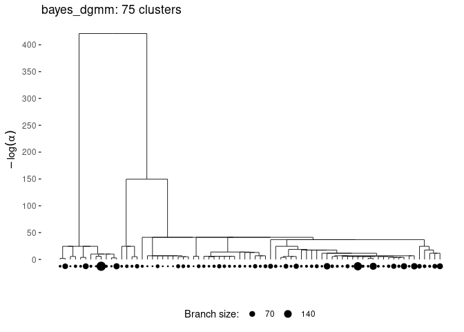
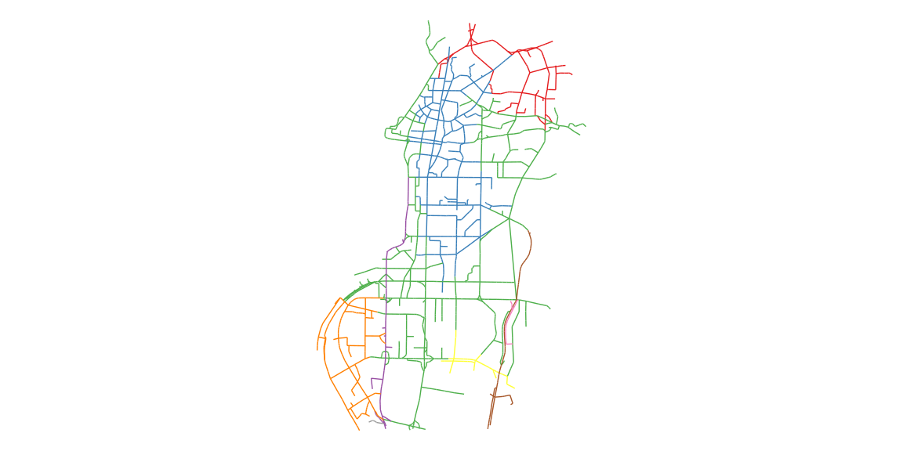

<!-- README.md is generated from README.Rmd. Please edit that file -->

# GTclust : A package for fast clustering of spatial or temporal data with contiguity constrained hierarchical clustering

<!-- badges: start -->
<!-- badges: end -->

GTclust builds on top of `?gtclust_graph` it’s main function to offers
fast clustering of spatial or temporal data with contiguity constrained
hierarchical clustering (with full-order relations see Diansheng Guo
(2009)). `?gtclust_graph` is a quite classical hierarchical algorithm
but which is designed to takes advantage of contiguity constraints
defined with a graph between data-points. The contiguity naturally
create a sparsely connected graph that can be leveraged to speed-up the
calculations, thanks to efficient data-structure (Ambroise et al. 2019),
from
")
to
+D))"),
with

the number of links in the contiguity graph. To reach these
performances, the dissimilarity matrix is computed on the fly and the
algorithm resort to a more simple “stored data” approach (Murtagh and
Contreras 2012), which even if known to be less efficient in the general
case are well fitted for the contiguity constrained problems with
full-order relations. This approach allows to have a low spatial
complexity of
")
but is less efficient with `single` and `complete` linkage criterions.
Furthermore, this make the use of non-euclidean dissimilarity measures
impossible. Still one may used the classical linkage criterion
compatible with a storage based approach and available in `hclust` or
`agnes` :

-   `ward` minimum within-cluster variance
-   `centroid` or WPGMC
-   `median` or UPGMC

Furthermore, GTclust also offers Bayesian models that enable model
selection :

-   `bayes_dgmm` diagonal Gaussian mixture models for continuous
    features
-   `bayes_mom` mixture of Multinomial for counts data
-   `bayes_dirichlet` mixture of Dirichlet distibution for compositional
    data

To ease, the contiguity graph creation process, gtclust offers several
interfaces to works with geographical, temporal (the gt in GTclust comes
from here) or sequential data:

-   `?gtclust_temp` to cluster sequential data, the contiguity graph
    follow from the data ordering
-   `?gtclust_line` to cluster spatial networks
-   `?gtclust_poly` to cluster data associated to geographical polygons,
    the contiguity graph follow from shared boundaries
-   `?gtclust_delaunay` to cluster data associated to geographical
    points, the contiguity graph is derived from the Delaunay
    triangulation of the points (thanks to the `? RTriangle` package
    (Shewchuk 1996))
-   `?gtclust_knn` to cluster data associated to geographical points,
    the contiguity graph is derived from the symmetrized knn graph of
    the geographical points (thanks to the `?RANN` package (Arya et al.
    2019))
-   `?gtclust_dist` to cluster data associated to geographical points,
    the contiguity graph is derived from a threshold over distance the
    geographical points

It also offers several methods dedicated ot the manipulations of spatial
results thanks to a tight integration with the sf package (Pebesma
2018).

## Installation

You can install the development version of gtclust from
[GitHub](https://github.com/) with:

``` r
# install.packages("devtools")
devtools::install_github("comeetie/gtclust")
```

## Simple, example

This is a basic example of spatial network clustering

``` r
library(gtclust)
library(dplyr)
library(sf)
library(ggplot2)
library(ggpubr)
data("shenzen")
hc = gtclust_lines(shenzen |> select(speed),method=gtmethod_bayes_dgmm())
plot(hc)
```



``` r
cl = cutree(hc,16)
```

To do the clustering, we use the `lines` flavor of GTclust and just
provide the lines data.frame we had just prepared. Then we may use the
classical function from `?hclust`, `?cutree` to cut the dendrogram at a
specific level and the `?plot.gtclust` method to draw the dendrogram. In
fact the result to a call to a gtclust\_\* function is a simple S3
object of class `?hclust` with additional fields. So the classical
merge, height and order fields are available:

``` r
class(hc)
#> [1] "gtclust"  "hclust"   "geoclust"
#str(hc,max.level = 1)
```

You may also use the `?geocutree` function which build directly a
spatial data.frame with the clustering results:

``` r
shenzen.clust = geocutree(hc,k=9)
shenzen.clust |> head()
#> Simple feature collection with 6 features and 3 fields
#> Geometry type: MULTILINESTRING
#> Dimension:     XY
#> Bounding box:  xmin: 2490587 ymin: 38502310 xmax: 2498958 ymax: 38515100
#> CRS:           NA
#>   cl   n     speed                       geometry
#> 1  1 190  9.865456 MULTILINESTRING ((2498033 3...
#> 2  2 492  6.003806 MULTILINESTRING ((2496446 3...
#> 3  3 914  8.943977 MULTILINESTRING ((2496290 3...
#> 4  4  88 12.383394 MULTILINESTRING ((2492307 3...
#> 5  5 185  7.717531 MULTILINESTRING ((2491822 3...
#> 6  6  46  6.362091 MULTILINESTRING ((2494717 3...
```

The returned data.frame contains the geometries of each cluster together
with their prototypes.

``` r
ggplot(shenzen.clust)+
  geom_sf(aes(color=factor(cl)))+
  theme_void()+
  scale_color_brewer(palette="Set1",guide="none")
```



# References

<div id="refs" class="references csl-bib-body hanging-indent">

<div id="ref-Ambroise2019" class="csl-entry">

Ambroise, Christophe, Alia Dehman, Pierre Neuvial, Guillem Rigaill, and
Nathalie Vialaneix. 2019. “Adjacency-Constrained Hierarchical Clustering
of a Band Similarity Matrix with Application to Genomics.” *Algorithms
for Molecular Biology* 14 (1): 22.

</div>

<div id="ref-RANN" class="csl-entry">

Arya, Sunil, David Mount, Samuel E. Kemp, and Gregory Jefferis. 2019.
*RANN: Fast Nearest Neighbour Search (Wraps ANN Library) Using L2
Metric*. <https://CRAN.R-project.org/package=RANN>.

</div>

<div id="ref-Guo2008" class="csl-entry">

Guo, D. 2008. “Regionalization with Dynamically Constrained
Agglomerative Clustering and Partitioning (REDCAP).” *International
Journal of Geographical Information Science* 22 (7): 801–23.
<https://doi.org/10.1080/13658810701674970>.

</div>

<div id="ref-Guo2009" class="csl-entry">

Guo, Diansheng. 2009. “Greedy Optimization for Contiguity-Constrained
Hierarchical Clustering.” In *2009 IEEE International Conference on Data
Mining Workshops*, 591–96. <https://doi.org/10.1109/ICDMW.2009.75>.

</div>

<div id="ref-Murtagh2012" class="csl-entry">

Murtagh, Fionn, and Pedro Contreras. 2012. “Algorithms for Hierarchical
Clustering: An Overview.” *WIREs Data Mining and Knowledge Discovery* 2
(1): 86–97. https://doi.org/<https://doi.org/10.1002/widm.53>.

</div>

<div id="ref-Pebesma2018" class="csl-entry">

Pebesma, Edzer. 2018. “<span class="nocase">Simple Features for R:
Standardized Support for Spatial Vector Data</span>.” *The R Journal* 10
(1): 439–46. <https://doi.org/10.32614/RJ-2018-009>.

</div>

<div id="ref-RTriangle" class="csl-entry">

Shewchuk, Jonathan Richard. 1996. “Triangle: Engineering a 2d Quality
Mesh Generator and Delaunay Triangulator.” In *Applied Computational
Geometry: Towards Geometric Engineering*, edited by Ming C. Lin and
Dinesh Manocha, 1148:203–22. Lecture Notes in Computer Science.
Springer-Verlag.

</div>

</div>
