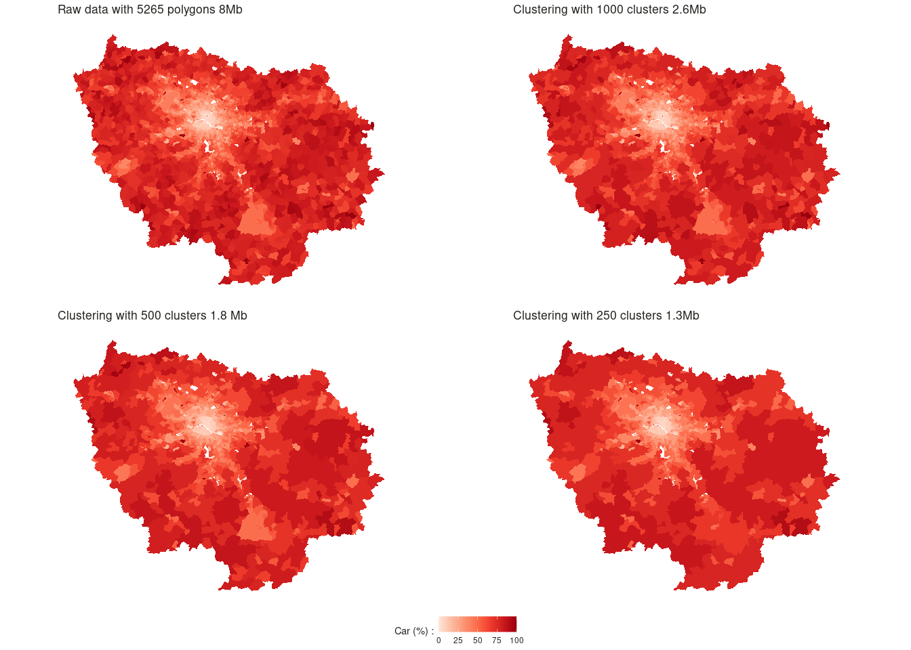

<!-- README.md is generated from README.Rmd. Please edit that file -->

# gtclust

<!-- badges: start -->
<!-- badges: end -->

gtclust builds on top of `?gtclust_graph` that enable hierarchical
clustering and takes advantage of contiguity constraints induced by a
graph. The contiguity naturally create a sparsely connected graph that
can be leveraged to speed-up the calculations from
")
to
+D))")
and deal with more than 10^5 data-points in seconds. To ease, the
contiguity graph creation process, gtclust offers several interfaces to
easily works with geographical, temporal (the gt in gtclust comes from
here) or sequential data:

-   `?gtclust_temp` to cluster sequential data, the contiguity graph
    follow from the data ordering
-   `?gtclust_poly` to cluster data associated to geographical polygons,
    the contiguity graph follow from shared boundaries
-   `?gtclust_delaunay` to cluster data associated to geographical
    points, the contiguity graph is derived from the Delaunay
    triangulation of the points
-   `?gtclust_knn` to cluster data associated to geographical points,
    the contiguity graph is derived from the symmetrized knn graph of
    the geographical points  
-   `?gtclust_dist` to cluster data associated to geographical points,
    the contiguity graph is derived from a threshold over distance the
    geographical points

Several aggregations methods are available with all of the
aforementioned interface. The classical linkage criterion available in
`hclust` :

-   `ward`
-   `centroid`
-   `median`

Note that, ut `gtclust` also offers, two bayesian criterion that enable
model selection :

-   `bayes_mom` mixture of multinomials for counts data
-   `bayes_dgmm` diagonal mixture models for continuous features

## Installation

You can install the development version of gtclust from
[GitHub](https://github.com/) with:

``` r
# install.packages("devtools")
devtools::install_github("comeetie/gtclust")
```

## Example

This is a basic example, we first prepare some spatial polygons data,
here the results at the municipality level in one french department for
the :

``` r
library(gtclust)
library(dplyr)
library(sf)
data("modesshare.idf")

modesshare.idf <- modesshare.idf |> 
  rowwise(CODE_IRIS) |> 
  mutate(total = sum(c_across(nodep:tcom)))

modesshare.idf.percent = modesshare.idf |> 
  filter(total!=0) |>
  transmute(across(nodep:tcom,\(v){v/total})) 
  
```

Do the clustering and use the classical function from `?hclust`
(`?plot.hclust` and `?cutree`):

``` r
hc=gtclust_poly(modesshare.idf.percent,method="ward")
#> Warning: Some features were not numeric and have been removed from the
#> clustering.
#> Warning: Some regions were isolated. The hierarchy was automatically completed
#> to reach one cluster.
plot(hc,labels=FALSE)
cutree(hc,k=30) |> head(20)
#>  1  2  3  4  5  6  7  8  9 10 11 12 13 14 15 16 17 18 19 20 
#>  1  1  2  3  4  5  6  4  7  3  8  9  1  1 10 11  4  8 12  4
```


You may also use the `?geocutree` function which build directly a
spatial data.frame with the clustering results:

``` r
modesshare_agg = geocutree(hc,k=500)
```



    #> Warning: attribute variables are assumed to be spatially constant throughout all
    #> geometries


``` r
res_mom = gtclust_delaunay(modesshare.idf |> st_centroid(),method="bayes_mom")
ggplot(data.frame(ts=res_mom$test.stat,K=(nrow(res_mom$data)-1):1))+
    geom_point(aes(x=K,y=ts))+theme_bw()
```


