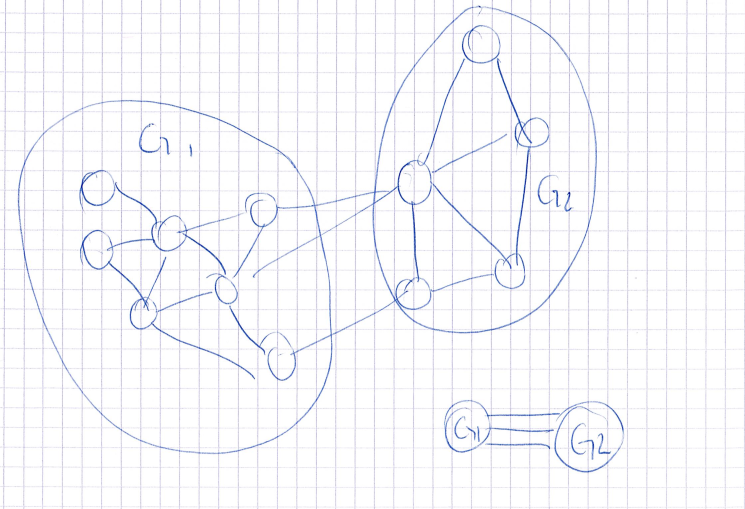
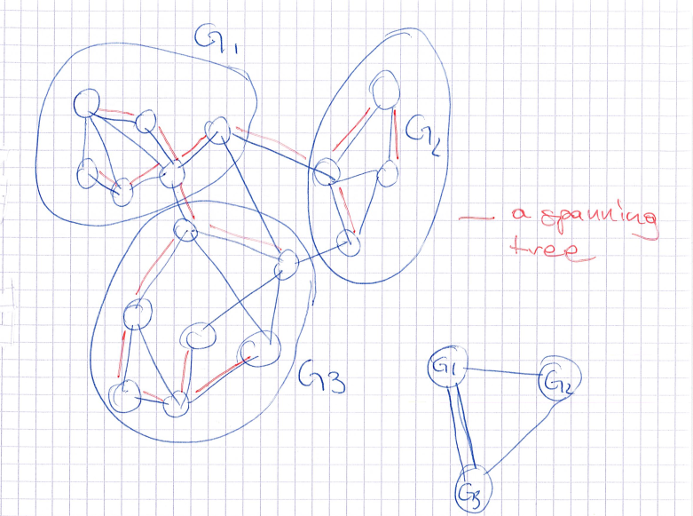

```{r setup, include=FALSE}
knitr::opts_chunk$set(echo = FALSE)
```

## Setting

Let $\partition \in \mathcal{P}_N$ be an ordered partition of $\{1,\hdots,N\}$, that is:
\begin{align}
    \partition = \left\{ \partition_1, \ldots, \partition_K \right\} & & \bigcup_k \partition_k = [N] & & \partition_k \bigcap \partition_l = \emptyset & & 
\end{align}

Let $\mathbf{X} = \{\mathbf{x}_1,\hdots,\mathbf{x}_N\}$ be a dataset\footnote{This can be extended to a case where $\mathbf{X}$ is an adjacency matrix.}. We suppose that all datapoints belonging to the same element of the partition are independent and identically distributed, \textit{i.e.} conditional independence:
$$p(\mathbf{x}|\mathbf{c})=\prod_k \int_\theta \prod_{i \in c_k}p(\mathbf{x}_i|\theta)p(\theta)d\theta$$


## Setting

$$\lobs(\mathbf{X},\partition_k)=\log\left(\int_\theta \prod_{i \in c_k}p(\mathbf{x}_i|\theta)p(\theta)d\theta\right)$$

In case of exponential Familly observations :

$$p(\bx|\theta)=\exp\left(\gamma(\theta).T(\bx)-A(\theta)+B(\bx)\right)$$ and $\lobs(\mathbf{X},\partition_k)=\phi(\sum_{i\in\partition_k}T(\bx_i))$

## Setting, MAP clustering

$$\hat{\partition}=\arg\max_{\partition}p(\mathbf{x},\partition)=\arg\max_{\partition}p(\mathbf{x}|\partition)p(\partition)$$
We need to define a prior for $\partition$ : $p(\partition)?$


## Chinese restaurant process

Process :
\begin{itemize}
    \item $\frac{\alpha}{n+\alpha}$ new table
    \item $\frac{n_k}{n+\alpha}$ at table $k$ 
\end{itemize}

Distribution
$$p(\mathbf{c}|\alpha)=\frac{\Gamma(\alpha)\alpha^{K}}{\Gamma(\alpha+N))}\prod_{k}\Gamma(n_k)$$


## Uniform

Completely uniform:
$p(\partition)=\frac{1}{\sum_{k=1}^N\mathcal{B}_n^k k!}$

Uniform in $k$ and then uniform over the partitions with $k$ elements:
\begin{eqnarray}
p(K)&=&\frac{1}{N}\\
p(\partition|K)&=&\frac{1}{\mathcal{B}_n^k k!}
\end{eqnarray}


## Uniform

Uniform in $k$, then uniform over possible counts and then uniform over the partitions with $k$ elements and the specific counts:
\begin{eqnarray}
p(K)&=&\frac{1}{N}\\
p(\mathbf{n}|K)&=&\binom{N-1}{K-1}^{-1}\\
p(\mathbf{c}|\mathbf{n})&=&\frac{1}{N!}\prod_kn_k! \times \mathbf{1}_{\{c / \mathbf{n}_\mathbf{c} = \mathbf{c} \}} \times \mathbf{1}_{\{c / \vert c \vert = K \}}
\end{eqnarray}

## Truncated geometric over K


\begin{eqnarray}
p(K)&=&\Ucolor{\frac{1}{1-\alpha^N}\alpha^{K-1}(1-\alpha)}\\
p(\mathbf{n}|K)&=&\frac{1}{C_{N-1}^{K-1}}\\
p(\mathbf{c}|\mathbf{n})&=&\frac{1}{N!}\prod_kn_k! \times \mathbf{1}_{\{c / \mathbf{n}_\mathbf{c} = \mathbf{c} \}} \times \mathbf{1}_{\{c / \vert c \vert = K \}}
\end{eqnarray}

$\alpha=1$ is equivalent to uniform, $\alpha=0$ to a dirac at $k=1$.

$$p(\mathbf{c}|\alpha)= p (\mathbf{c}, \mathbf{n}_\mathbf{c}, K_\mathbf{c}) = \frac{1}{1-\alpha^N}\alpha^{K-1}(1-\alpha)\frac{1}{C_{N-1}^{K-1}}\frac{1}{N!}\prod_kn_k!$$

## Truncated geometric over K and dendograms

```{r,include=FALSE,echo=FALSE}
library(readr)
library(sf)
library(dplyr)
profs = read_sf("./valid_profiles_idfm.geojson")
trH = paste0("X",0:23,"H.",c(1:23,0),"H")
trH=c(trH[6:24],trH[1:2])

df_clust = profs[,c(trH,"geometry")]

X=as.matrix(df_clust|>st_drop_geometry())

library(gtclust)
sol_dir = gtclust_knn(df_clust,10,method="bayes_dirichlet")
```


```{r}
library(ggplot2)
df=data.frame(Ll=sol_dir$Ll,k=length(sol_dir$Ll):1)
ggplot(df)+geom_line(aes(x=k,y=-Ll))+geom_point(aes(x=k,y=-Ll))+theme_bw()+scale_x_reverse("K")+scale_y_continuous(expression("log(p(X,c|K))"))+ggtitle(expression("log(p(X,c|K)) with respect to K at \alpha=1"))
```

## Truncated geometric over K and dendograms
```{r}
df=data.frame(Ll=sol_dir$Ll,k=length(sol_dir$Ll):1)
ggplot(df |> filter(k<55))+geom_line(aes(x=k,y=-Ll))+geom_point(aes(x=k,y=-Ll))+theme_bw()+scale_x_reverse("K")+scale_y_continuous(expression("p(X,c|K)"))+ggtitle(expression("p(X,c|K) with respect to K at alpha=1"))
```

## Truncated geometric over K and dendograms

```{r}
front(sol_dir)
```

## Truncated geometric over K and dendograms

```{r}
plot(sol_dir)
```


## Contiguity constrained clustering


## Contiguity constrained clustering

We get a graph $G$  and clusters must be connected in the graph.

$$\Leftrightarrow$$
A clustering can be obtained by cutting $K-1$ edges in a spanning tree of $G$.

Pbr how to count the number of possible partition with $k$ elements with theses constraints ?
Easy for trees and lines : their are $C_{k-1}^{N-1}$ possible compatible partitions. 
But for generic graphs ?

## Contiguity constrained clustering
Example :

```{r, include=FALSE,echo=FALSE}
library(R.matlab)
library(dplyr)
library(sf)
library(ggplot2)
nodes_raw  = readMat("NODES.mat")
nodes = data.frame(x=nodes_raw$Node[,1],y=nodes_raw$Node[,2],id=1:nrow(nodes_raw$Node))


links_raw  = readMat("LINKS.mat")
links = data.frame(from=links_raw$Link.1[,1],to=links_raw$Link.1[,2])
links=links |> left_join(nodes,by=c("from"="id"))|> left_join(nodes,by=c("to"="id"),suffix=c("","_to"))
Lp = as.matrix(links[,3:6])
links_geom = st_sfc(lapply(1:nrow(links),\(l){ st_linestring(rbind(Lp[l,1:2],Lp[l,3:4]))}))
links$geometry = links_geom
links.sf=st_sf(links)


speeds_raw  = readMat("SPEEDS.mat")
col_n = paste0("T",floor(((1:288)*5)/60),"H",((1:288)*5)%%60)
days = paste0("D",7:9)
speeds = do.call(cbind,lapply(1:3,\(id){
  df=data.frame(speeds_raw[[id]])
  df[df==0]=NA
  colnames(df)=paste0(days[id],col_n)
  df
}))


speeds_long = speeds |> mutate(link_id=1:n())|> 
  tidyr::pivot_longer(-link_id,names_to = "day_h",values_to = "speed") 
  
  
v=speeds_long |> filter(day_h=="D7T8H30"|day_h=="D7T8H35"|day_h=="D7T8H40") |> 
  group_by(link_id) |> 
  summarise(speed=mean(speed,na.rm=TRUE))  

v$speed[is.na(v$speed)]=mean(v$speed,na.rm = TRUE)
links.sf$speed=v$speed

sum(is.na(links.sf$speed))
```

```{r}
ggplot(links.sf)+geom_sf(aes(color=speed*3.6),size=1.1)+
  scale_color_distiller("Speed (km/h)",palette="RdYlGn",direction = 1,limits=c(0,65))+
  theme_void()+
  theme(legend.position="left")+
  ggtitle("Shenzen speed distribution","8h30-8h45")
```

## Spanning tree prior

\begin{itemize}
    \item $\sptree$ a spanning tree of $G$, 
    \item $\sptreeset_G$ the set of all spanning tree of $G$,
    \item a partition $\partition$ is compatible with a spanning tree $\sptree$, noted  $\partition\compat\sptree$; if $\partition$ corresponds to the set of connected components obtained by pruning $|\partition|-1$ edges from $\sptree$,
    \item if this is not the case $\partition$ is not compatible with a spanning tree $\sptree$ and we denote this property by $\partition\notcompat\sptree$.
\end{itemize}

## Spanning tree prior

Sample spanning tree and cut them

\begin{align*}
p(K|\alpha)&=\frac{1}{1-\alpha^N}\alpha^{K-1}(1-\alpha)\\
p(\sptree) &= \frac{1}{|\sptreeset_G|}\\
p(\partition|\sptree,K) &= \frac{1}{C_{K-1}^{N-1}}\mathbf{1}_{\{\partition / \partition\compat\sptree \}}
\end{align*}


## Spanning tree prior

If we marginalize out the sampling of the spanning trees  we get :

\begin{align*}
p(\partition|K)&=\sum_{\sptree\in\sptreeset_G}p(\partition|\sptree,K)p(\sptree)\\
&=\frac{1}{|\sptreeset_G|C_{K-1}^{N-1}}\sum_{\sptree\in\sptreeset_G}\mathbf{1}_{\{\partition / \partition\compat\sptree \}}\\
&=\frac{|\{\sptree / \partition\compat\sptree \}|}{|\sptreeset_G|C_{K-1}^{N-1}}
\end{align*}

We need to compute $|\sptreeset_G|$  and $|\{\sptree / \partition\compat\sptree \}|$ ?


## Kirchhoff's theorem 

Kirchhoff's theorem:

$$|\sptreeset_G|=\frac{1}{N}\lambda_1...\lambda_{N-1},$$

with $\lambda_i$ be the non-zero eigenvalues of Laplacian matrix $L$ of $G$. Practically, we compute $\log(|\sptreeset|)$ as $\log(det(L_{\text{-}1,\text{-}1}))$. If the graph is sparse, this can be solved in a reasonable amount of time via using a sparse $LU$/ Cholevsky decomposition. 


## Cuset theorem 


\begin{itemize}
 \item $G[\partition_k]$ the subgraph of $G$ induced by $\partition_k$,
    \item $\cutset(G,\partition_g,\partition_h)=\{(u,v)\in E / u\in \partition_g, v\in \partition_h\}$, the set of edges of $G$ between element $g$ and $h$ of $\partition$, 
    \item $G\pproj\partition$ the multigraph $(\{1,...,K\},\{(g,h,|\cutset(G,\partition_g,\partition_h)|)/ g\neq h\})$ obtained by counting the number of links in $G$ between each pairs of different elements of $\partition$.
\end{itemize}


## Cuset theorem 


## Cuset theorem 



## Cuset theorem 
$$\log(|\{\sptree / \partition\compat\sptree \}|)=\overbrace{\sum_{k=1}^K\log(|\sptreeset_{G[\partition_k]}|)}^{\text{intra-cluster spanning trees}}+\underbrace{log(|\sptreeset_{G\pproj\partition}|)}_{\text{inter-clusters spanning trees}}$$

## Cuset theorem 

When the partition is a simple cut  $\partition=\{\partition_1,\partition_2\}$, this reduce to :


$$|\{\sptree / \partition\compat\sptree \}|=|\sptreeset_{G[\partition_1]}||\sptreeset_{G[\partition_2]}||\cutset(G,\partition_1,\partition_2)|$$


## Marginalizing one more time

$$\Delta_{g\cup h} = \log\left(\sum_{\mathbf{b}/\exists i : \mathbf{b}_i=\partition_g\cup\partition_h}p(\mathbf{b},\mathbf{X},K)\right)-\log\left(\sum_{\mathbf{b} / \exists i,j : \mathbf{b}_i=\partition_g,\mathbf{b}_j=\partition_h}p(\mathbf{b},\mathbf{X},K)\right)$$

So we have marginalized outside of $\partition_g\cup\partition_h$. By doing so we get a simpler formula which only involve $|\cutset(G,\partition_g,\partition_h)|$ and avoid the computation of $|\sptreeset_{G\pproj\partition}|$. 

## Marginalizing one more time

\begin{gather}
\Delta_{g\cup h}=\lobs(\mathbf{X},\partition_g\cup \partition_h)-\lobs(\mathbf{X},\partition_g)-\lobs(\mathbf{X},\partition_h)\nonumber\\+
\log\left(\frac{|\sptreeset_{G[\partition_h\cup\partition_h]}|}{|\cutset(G,\partition_g,\partition_h)||\sptreeset_{G[\partition_h]}||\sptreeset_{G[\partition_g]}|}\right)
\end{gather}


## Rank one updates

$$L(G[\partition_g\cup\partition_h])=\begin{pmatrix}
L(G[\partition_g])&0  \\
0 & L(G[\partition_h])
\end{pmatrix}
+\sum_{u,v\in\cutset(G,\partition_g,\partition_h)}I(u,v)^tI(u,v)$$


## Results shenzen


```{r}
hc_res=gtclust_lines(links.sf |> select(speed),gtmethod_bayes_dgmm())
df=data.frame(Ll=hc_res$Ll,k=length(hc_res$Ll):1)
ggplot(df |> filter(k<55))+geom_line(aes(x=k,y=-Ll))+geom_point(aes(x=k,y=-Ll))+theme_bw()+scale_x_reverse("K")+scale_y_continuous(expression("p(X,c|K)"))+ggtitle(expression("p(X,c|K) with respect to K at alpha=1"))
```

## Results shenzen
```{r}
hc_res=gtclust_lines(links.sf |> select(speed),gtmethod_bayes_dgmm())
plot(hc_res)
```


## 
```{r}
gt_res= geocutree(hc_res,14) |> mutate(L=st_length(geometry)) |> filter(L>2500)
ggplot(gt_res)+
  geom_sf(aes(color=factor(cl)))+
  theme_void()+
  scale_color_brewer(palette="Set1",guide="none")+
  ggtitle("Shenzen clustering results","8h30-8h45")
```

## 
```{r}
ggplot(gt_res)+
  geom_sf(aes(color=speed*3.6))+
  theme_void()+
  scale_color_distiller("Speed (km/h)",palette="RdYlGn",direction = 1)+
  theme(legend.position="left")+
  ggtitle("Shenzen clustering results","8h30-8h45")
```
